# MedGraphRAG Presentation Slides

## Writing Rule

Write the slides in Simplified Technical English.

- Use short sentences.
- Use active voice.
- Put one idea in each sentence.
- Use the same word for the same thing.
- Avoid weak claims.
- Mark future work as future work.
- Do not claim clinical use.

## Main Story

Focus the talk on data transformation.

The key question is not only whether the app works.

The key question is how the data changes.

Show each representation:

1. PMC ID list.
2. BioC JSON.
3. Clean article text.
4. Overlapping chunks.
5. Entity records.
6. Relationship records.
7. Neo4j graph.
8. Retrieved evidence objects.
9. Answer with sources.

## Demo Plan

Use a short live demo.

- Keep the demo to 3-5 minutes.
- Use the demo to show transformed data.
- Do not use the demo as the main proof.

Demo only these parts:

1. Open the Home page.
2. Show the active model profile.
3. Open the Graph page.
4. Search `statins`, `LDL`, or `triglycerides`.
5. Select one relationship.
6. Show evidence, PMCID, and chunk ID.
7. Open the Chat page.
8. Ask one prepared question.
9. Show the answer, sources, and reasoning path.

Do not demo these parts unless asked:

- Full PMC ingestion.
- Model download.
- Schema setup.
- DVC runs.
- MLflow runs.
- Neo4j clear controls.
- Long extraction jobs.

---

## Slide 1 - Title

### Slide Content

**MedGraphRAG**

**Transforming Biomedical Literature Into Traceable Graph Evidence**

Anthony Litwin  
ODU Data Science Capstone  
Summer 2026

**Focus:** Data transformation from article text to supported answer.

### Slide Visual

Use this Mermaid diagram.

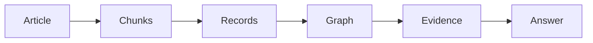

### Delivery

**Mode:** Demo + verbal.

**Demo:** Show the Home page for 20-30 seconds.

**Say:** This project is a data transformation pipeline. The app shows the pipeline running end to end.

---

## Slide 2 - Transformation Goal

### Slide Content

**Goal**

Convert biomedical prose into structured evidence.

**Input**

- Long PMC articles.
- Variable biomedical terms.
- Relationships written in prose.

**Output**

- Typed entities.
- Typed relationships.
- Source evidence.
- Graph paths.
- Cited answers.

### Slide Visual

Use this Mermaid diagram.

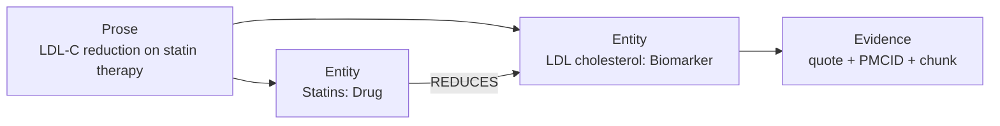

### Delivery

**Mode:** Diagram + verbal.

**Demo:** Do not demo this slide.

**Say:** This is the only problem setup slide. The rest of the talk follows the data.

---

## Slide 3 - Input Representation

### Slide Content

**Input data**

- The seed list has 30 PMC IDs.
- The topic is lipids and cardiovascular disease.
- The current run has 28 BioC successes.
- Two articles had no BioC result.

**First representation**

- NCBI PMC Open Access BioC JSON.
- Raw JSON is preserved.
- The parser uses the first BioC document.

### Slide Visual

Use this Mermaid diagram.

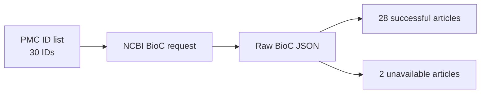

### Delivery

**Mode:** Diagram + verbal.

**Demo:** You can point to the Home page workflow.

**Say:** The project starts with a focused source list. It does not start with web search.

---

## Slide 4 - BioC JSON to Clean Text

### Slide Content

**Transformation 1**

BioC JSON becomes a clean article record.

**Kept fields**

- PMCID.
- Title.
- Year.
- Journal.
- DOI.
- Authors.
- Passage text.
- Passage section.

**Lost or simplified fields**

- BioC annotations are not used.
- BioC relationships are not used.
- Layout details are simplified.

### Slide Visual

Use this Mermaid diagram.

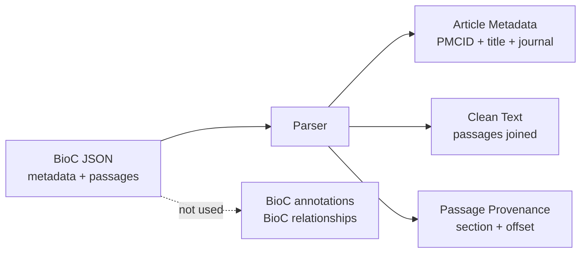

### Delivery

**Mode:** Diagram + verbal.

**Demo:** Do not demo this slide.

**Say:** This step changes nested BioC data into the simpler text form used by extraction.

---

## Slide 5 - Clean Text to Chunks

### Slide Content

**Transformation 2**

Clean article text becomes overlapping chunks.

**Chunk fields**

- Chunk ID.
- Chunk order.
- Start offset.
- End offset.
- Section.
- Text.

**Current settings**

- Maximum size: 6,000 characters.
- Overlap: 500 characters.
- Boundary: word boundary when possible.

### Slide Visual

Use this Mermaid diagram.

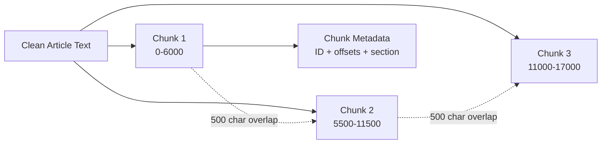

### Delivery

**Mode:** Diagram + verbal.

**Demo:** Do not demo chunking live.

**Say:** Chunking controls what evidence the extractor can see at one time.

---

## Slide 6 - Chunks to Entity Records

### Slide Content

**Transformation 3**

Each chunk becomes entity records.

**Entity detection**

- GLiNER-BioMed detects mentions.
- The threshold is 0.50.
- The labels are Drug, Condition, Symptom, RiskFactor, and Biomarker.

**Entity normalization**

- Exact aliases are checked first.
- MiniLM similarity is checked next.
- Unknown names keep a cleaned surface form.
- Original mention text is kept.

### Slide Visual

Use this Mermaid diagram.

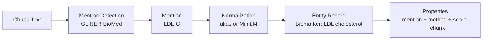

### Delivery

**Mode:** Diagram + verbal.

**Demo:** Do not run extraction live.

**Say:** This step changes text spans into typed, named records.

---

## Slide 7 - Entity Records to Relationship Records

### Slide Content

**Transformation 4**

Entity pairs become relationship records.

**Candidate rules**

- Pairs must be nearby.
- Pairs must be in one sentence or adjacent sentences.
- Pairs must be within 300 characters.

**Scoring inputs**

- Semantic similarity.
- Word cues.
- Distance.
- Entity confidence.

**Validation checks**

- Type.
- Direction.
- Evidence.
- Confidence.

### Slide Visual

Use this Mermaid diagram.

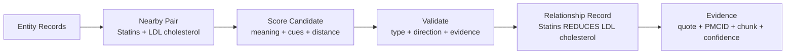

### Delivery

**Mode:** Diagram + verbal.

**Demo:** Do not demo scoring live.

**Say:** This is the main weak step. Correct entities do not guarantee correct relationships.

---

## Slide 8 - Records to Knowledge Graph

### Slide Content

**Transformation 5**

Validated records become a Neo4j graph.

**Graph nodes**

- Paper nodes.
- Drug nodes.
- Condition nodes.
- Symptom nodes.
- RiskFactor nodes.
- Biomarker nodes.

**Graph edges**

- `MENTIONS` links papers to entities.
- Biomedical relationships link entities.
- Each relationship keeps evidence.
- Each relationship keeps PMCID and chunk ID.

### Slide Visual

Use this Mermaid diagram.

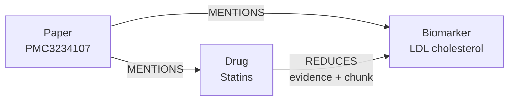

### Delivery

**Mode:** Demo + diagram.

**Demo:** Open Graph. Search `statins`. Select one relationship. Show the evidence fields.

**Say:** The graph is not only storage. It is a new representation of evidence.

---

## Slide 9 - Graph to Evidence Objects

### Slide Content

**Transformation 6**

The graph becomes a ranked evidence context.

**Retrieval steps**

- Expand question terms.
- Match graph nodes.
- Retrieve direct edges.
- Retrieve two-hop paths when requested.
- Add up to three definitions.
- Rank the evidence.
- Return up to 12 evidence objects.

**Evidence object fields**

- Source entity.
- Relationship.
- Target entity.
- Evidence text.
- Confidence.
- PMCID.
- Chunk ID.
- Path order.

### Slide Visual

Use this Mermaid diagram.

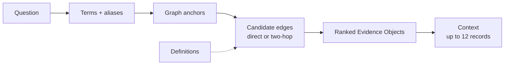

### Delivery

**Mode:** Demo + diagram.

**Demo:** Use Graph first. Then use Chat to show returned sources.

**Say:** This step converts a graph query result into the small context used for answering.

---

## Slide 10 - Evidence Objects to Answer

### Slide Content

**Transformation 7**

Evidence objects become an answer object.

**Answer object fields**

- Answer text.
- Sources.
- Reasoning path.
- Confidence.
- Abstention flag.
- Model profile.

**Answer controls**

- The prompt allows only retrieved evidence.
- The answer must use a JSON shape.
- The answerer can abstain.

### Slide Visual

Use this Mermaid diagram.

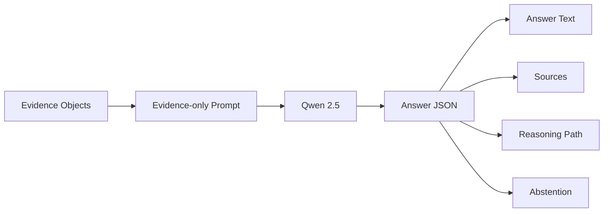

### Delivery

**Mode:** Demo + diagram.

**Demo:** Open Chat. Ask one prepared question.

Use one of these questions:

- `What does statin therapy reduce?`
- `How are triglycerides associated with cardiovascular risk?`
- `What evidence links LDL cholesterol and cardiovascular disease?`

**Say:** The final answer is also a data record. It contains sources and a path.

---

## Slide 11 - Evaluate Each Transformation

### Slide Content

**Graph construction evaluation**

- Gold set: 5 papers.
- Gold set: 43 chunks.
- Entity F1: **0.528**.
- Relationship F1: **0.086**.
- Earlier frontier reference entity F1: **0.655**.
- Earlier frontier reference relationship F1: **0.484**.

**Question answering evaluation**

- Question set: 6 development questions.
- Retrieval recall: **0.333**.
- Answer accuracy: **0.333**.
- Citation support: **0.667**.

### Slide Visual

Use this Mermaid diagram.

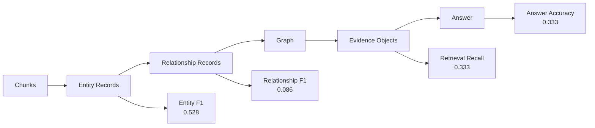

### Delivery

**Mode:** Diagram + verbal.

**Demo:** Do not run evaluation live.

**Say:** The evaluation locates the weak transformation. Relationship construction is the main bottleneck.

---

## Slide 12 - Conclusion

### Slide Content

**What the transformation adds**

- It adds typed entities.
- It adds typed relationships.
- It adds graph paths.
- It adds source evidence.
- It adds answer sources.

**What the transformation can lose**

- Layout.
- Some BioC structure.
- Cross-chunk relationships.
- Out-of-schema concepts.
- Some uncertainty and context.

**Next work**

- Audit schema and gold labels.
- Build a larger PMCID holdout set.
- Improve relationship extraction.
- Add chunk-vector RAG.
- Compare graph, vector, and hybrid retrieval.
- Measure latency and cost.

### Slide Visual

Use this Mermaid diagram.

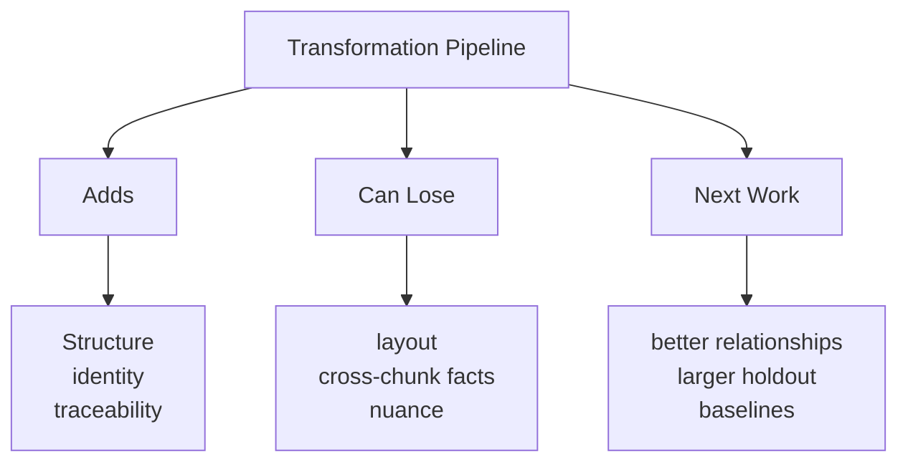

### Delivery

**Mode:** Diagram + verbal.

**Demo:** End on the slide. Do not switch back to the app unless asked.

**Say:** The strongest claim is about traceable data transformation. The project shows where information is gained and lost.
