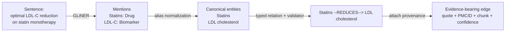
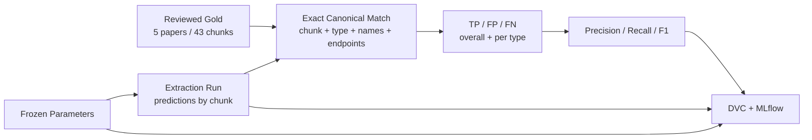
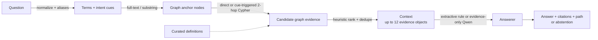

```mermaid
flowchart LR
    A["PMC BioC JSON<br/>metadata + passages"] -->|parse + clean| B["Parsed Article<br/>text + passage provenance"]
    B -->|6000 chars / 500 overlap| C["Chunks<br/>ID + offsets + sections"]
    C -->|GLiNER| D["Typed Mentions<br/>5 biomedical types"]
    D -->|alias / cosine normalize<br/>score + validate| E["Graph Records<br/>entities + relations + evidence"]
    E -->|MERGE by deterministic IDs| F["Knowledge Graph<br/>nodes + typed edges"]
    F -->|full-text anchor + Cypher paths| G["Retrieved Evidence<br/>ranked edges / 2-hop paths"]
    G -->|add curated definitions<br/>limit to 12| H["QA Context<br/>schema-shaped JSON"]
    H -->|extract or Qwen 2.5| I["Answer<br/>citations + abstention"]
```

# MedGraphRAG Presentation Content

## Slide 1 — MedGraphRAG

- Research question: can structured graph evidence improve traceable biomedical QA?
- Domain: PMC literature on lipids and cardiovascular disease
- Output: cited answer—or abstention when evidence is insufficient

**Recommended visual:** One horizontal transformation: `Article → Graph Facts → Evidence → Answer`.

**Speaker objective:** Frame the project as a data-representation experiment implemented as an end-to-end application, not primarily as a software architecture project.

## Slide 2 — The Data Science Problem

- Biomedical findings are distributed across long, heterogeneous prose
- Synonyms obscure identity: `LDL-C` = `low-density lipoprotein cholesterol`
- Relationships, direction, uncertainty, and provenance are implicit
- Goal: structured facts that remain linked to source evidence

**Recommended visual:** Split slide: dense article text on the left; a small typed, cited graph on the right.

**Speaker objective:** Explain why retrieval over raw text is difficult and what new information becomes explicit after transformation.

## Slide 3 — End-to-End Data Transformation

- BioC JSON → cleaned article text → overlapping chunks
- Chunks → typed mentions → normalized entities
- Entity pairs → scored relations → validated graph records
- Graph paths + definitions → evidence objects → answer

**Recommended visual:** Use Diagram A below, with the data form in large text and the operation in a small arrow label.

**Speaker objective:** Give the audience the complete map once. Emphasize that each stage changes the representation and introduces both value and possible loss.

## Slide 4 — Raw Text → Chunks

- Main default: 6,000 characters, 500-character overlap
- Word-boundary preference; stable PMCID chunk IDs
- Retains offsets, order, section/type, and source sections
- Trade-off: bounded context vs duplicated text and missed cross-chunk facts

**Recommended visual:** A document strip divided into three overlapping colored windows; annotate IDs and character offsets.

**Speaker objective:** Explain why extraction is performed on bounded windows and why chunking is a modeling decision, not merely preprocessing.

## Slide 5 — Text → Structured Knowledge

- Text: “...optimal LDL-C reduction on statin monotherapy...”
- Entities: `Statins: Drug`; `LDL-C: Biomarker`
- Normalize: `LDL-C → LDL cholesterol`
- Fact: `(Statins)-[:REDUCES]->(LDL cholesterol)` + evidence + chunk

**Recommended visual:** Use Diagram B below. Mark the example as “human-reviewed gold example.”

**Speaker objective:** Walk slowly through the most important transformation: prose becomes schema-constrained, queryable data while the evidence excerpt remains attached.

## Slide 6 — Building the Knowledge Graph

- Entity ID: type + normalized-name slug
- Nodes merged by ID; relationships merged by evidence-specific hash
- `Paper-[:MENTIONS]->Entity` preserves document membership
- Fact edges retain confidence, PMCID, chunk, model, and graph run

**Recommended visual:** Structured JSON card feeding a three-node graph with a Paper node and one fact edge.

**Speaker objective:** Focus on the representational change from records to connected facts. Explain both the deduplication benefit and the limitation of name-based identity.

## Slide 7 — Graph → Answer

- Question terms expand through curated aliases/definitions
- Full-text/substr entity anchoring → direct or two-hop Cypher paths
- Heuristic ranking returns up to 12 evidence objects
- Extractive answer or Qwen 2.5 evidence-only JSON; otherwise abstain

**Recommended visual:** Use Diagram D below and display one evidence object with endpoints, evidence excerpt, and chunk ID.

**Speaker objective:** Show exactly what the answer model receives. State clearly that the current implementation is graph retrieval plus optional definitions, not vector chunk retrieval.

## Slide 8 — Two Evaluation Layers

- **Graph construction:** entity and relation precision / recall / F1
- Latest full current run: entity F1 **0.528**; relation F1 **0.086**
- **QA:** retrieval, fact coverage, citations, paths, abstention
- Latest six-question dev run: retrieval **0.333**; answer accuracy **0.333**
- DVC reproduces state; MLflow compares parameters, metrics, artifacts

**Recommended visual:** Two parallel scorecards separated by a vertical line; use Diagram C for the graph-construction side.

**Speaker objective:** Make relationship extraction the identified bottleneck and avoid overstating small development-set results. Explain why graph accuracy and QA accuracy must be diagnosed separately.

## Slide 9 — Key Decisions and Trade-offs

- 6,000/500 chunks: context preservation vs pair ambiguity
- Strict ontology: queryability vs loss of nuance and out-of-schema facts
- Local non-instruction extraction: auditability/locality vs low relation F1
- Name normalization: fewer duplicates vs false merges/splits
- Graph paths: explicit structure vs incomplete graph coverage

**Recommended visual:** Five balanced scales or a two-column “gain / cost” table.

**Speaker objective:** Demonstrate that every transformation encodes assumptions. Connect observed errors to those decisions rather than treating the pipeline as a black box.

## Slide 10 — Conclusion and Next Experiment

- Achieved: raw PMC prose → traceable graph evidence → cited QA
- Main bottleneck: relation semantics, direction, and coverage
- Next: schema–gold audit, larger PMCID holdout, relation calibration
- Then: hybrid graph + vector baseline, cross-chunk links, cost/latency metrics

**Recommended visual:** Repeat the Slide 3 pipeline; highlight relation extraction in amber and future evaluation additions in blue.

**Speaker objective:** End with the data-transformation contribution and a disciplined next-step sequence. Separate completed functionality from proposed improvements.

---

# Deliverable 3 — Diagram Specifications

## Diagram A — Full Data Transformation Pipeline

**Boxes/nodes, left to right:**

1. `PMC BioC JSON` — metadata + passage objects
2. `Parsed Article` — cleaned contiguous text + passage provenance
3. `Overlapping Chunks` — text + ID + offsets + sections
4. `Typed Mentions` — Drug / Condition / Symptom / RiskFactor / Biomarker
5. `Normalized Graph Records` — canonical entities + scored relations + evidence
6. `Neo4j Knowledge Graph` — Paper/entity nodes + typed edges
7. `Retrieved Evidence` — ranked direct/two-hop paths + definitions
8. `QA Context` — ≤12 schema-shaped evidence objects
9. `Answer` — text + citations + reasoning path + abstention

**Arrows:** `fetch/parse`, `6,000 chars + 500 overlap`, `GLiNER`, `normalize/score/validate`, `MERGE`, `full-text + Cypher rank`, `assemble`, `extract or generate`.

**Optional grouping:** Group boxes 1–3 as **Text representation**, 4–6 as **Knowledge construction**, and 7–9 as **Evidence-grounded QA**. Use a small red warning triangle below chunks (“cross-chunk relations may be lost”) and below graph records (“extraction errors become graph errors”).

## Diagram B — Extraction Example

**Actual project sentence:** `“...continuing risk despite optimal LDL-C reduction on statin monotherapy remains high...”`

**Boxes/nodes:**

1. `Raw sentence` — the sentence above
2. `Detected mentions` — `Statins → Drug`; `LDL-C → Biomarker`
3. `Normalized entities` — `Statins`; `LDL cholesterol` (`LDL-C` retained as mention text)
4. `Structured relation` — `source=Statins`, `type=REDUCES`, `target=LDL cholesterol`
5. `Graph + evidence` — two nodes, a directed edge, evidence text, PMCID, chunk ID, confidence

**Arrows:** `GLiNER`, `terminology normalization`, `relation extraction + validation`, `load`.

**Optional grouping:** Put boxes 2–4 inside **Structured extraction record**. Add a caption: “Human-reviewed gold example from PMC3234107; target representation, not a claim of perfect current extraction.”

## Diagram C — Evaluation Pipeline

**Boxes/nodes:**

1. `Reviewed Gold Data` — 5 papers; 43 chunks; accepted entities/relations
2. `Frozen Model + Parameters` — profile, thresholds, terminology, code version
3. `Extraction Run` — one prediction set per chunk
4. `Canonical Match Keys` — entity: chunk/type/name; relation: chunk/type/typed endpoints
5. `TP / FP / FN` — overall and per type
6. `Precision / Recall / F1`
7. `DVC + MLflow` — dependencies/outputs + parameters/metrics/artifacts

**Arrows:** gold and predictions both feed canonical matching; matching feeds counts; counts feed metrics; run state and metrics feed DVC/MLflow.

**Optional grouping:** Show gold and predicted data as parallel lanes. Add “artifact-only: Neo4j is not modified” beneath the extraction run.

## Diagram D — QA Retrieval Pipeline

**Boxes/nodes:**

1. `Question` — natural language
2. `Question Terms` — normalized tokens + aliases + intent cues
3. `Graph Anchors` — Neo4j full-text index or substring match
4. `Candidate Evidence` — direct edges; optional two-hop paths; curated definitions
5. `Ranked Context` — term/concept/relation/path/confidence score; maximum 12
6. `Answerer` — extractive rule or Qwen 2.5 with evidence-only prompt
7. `Output` — answer + sources + ordered reasoning path, or abstention

**Arrows:** `normalize/expand`, `anchor`, `Cypher traverse`, `score/deduplicate`, `compose`, `return`.

**Optional grouping:** Group boxes 2–5 as **Retrieval**, box 6 as **Generation**, and box 7 as **Auditable output**. Use a dashed arrow from `Curated definitions` into candidate evidence to show that definitions are separate from PMC graph facts.

