# MedGraphRAG Presentation Slides

## Writing Rule

Write the slides in Simplified Technical English.

- Use short sentences.
- Use active voice.
- Put one idea in each sentence.
- Use the same word for the same thing.
- Avoid weak claims.
- Mark future work as future work.
- Do not claim clinical use.

## Demo Plan

Use a short live demo.

- Keep the demo to 3-5 minutes.
- Show the app as proof of the system.
- Keep the main story on data flow and evaluation.

Demo only these parts:

1. Open the Home page.
2. Show the active model profile.
3. Open the Graph page.
4. Search `statins`, `LDL`, or `triglycerides`.
5. Select one edge.
6. Show evidence, PMCID, and chunk ID.
7. Open the Chat page.
8. Ask one prepared question.
9. Show the answer, sources, and reasoning path.

Do not demo these parts unless asked:

- Full PMC ingestion.
- Model download.
- Schema setup.
- DVC runs.
- MLflow runs.
- Neo4j clear controls.
- Long extraction jobs.

---

## Slide 1 - Title

### Slide Content

**MedGraphRAG**

**Building a Biomedical Knowledge Graph for Explainable Question Answering**

Anthony Litwin  
ODU Data Science Capstone  
Summer 2026

**Question:** Can graph evidence make biomedical question answering more traceable?

### Slide Visual

Use this Mermaid diagram on the title slide.

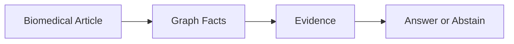

### Delivery

**Mode:** Demo + verbal.

**Demo:** Show the Home page for 20-30 seconds.

**Say:** This project studies a data transformation. It turns biomedical text into graph evidence. The app shows the full system.

---

## Slide 2 - Problem

### Slide Content

**Biomedical text is hard to query.**

- Articles are long.
- Terms vary across papers.
- Relationships are in prose.
- Direction is often implicit.
- Source evidence is hard to inspect.

**Goal:** Convert text into typed facts with source evidence.

### Slide Visual

Use this Mermaid diagram.

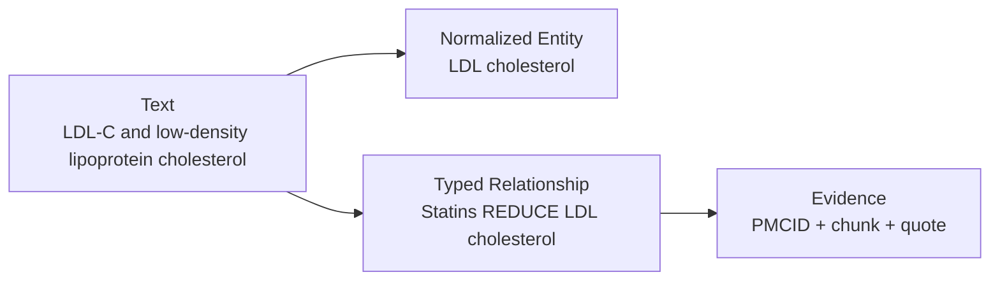

### Delivery

**Mode:** Diagram + verbal.

**Demo:** Do not demo this slide.

**Say:** Raw text has useful facts. The system must make those facts explicit.

---

## Slide 3 - Data Source

### Slide Content

**Source data**

- The corpus has 30 PMC article IDs.
- The topic is lipids and cardiovascular disease.
- The current run has 28 BioC successes.
- Two articles had no BioC result.
- The processed corpus has 231 chunks.
- It has 3,046 entity records.
- It has 207 relationship records.

**Input format:** NCBI PMC Open Access BioC JSON.

### Slide Visual

Use this Mermaid diagram.

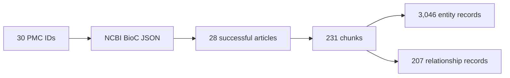

### Delivery

**Mode:** Diagram + verbal.

**Demo:** You can point to the Home page workflow if it helps.

**Say:** This is a focused seed corpus. It is not a full biomedical benchmark.

---

## Slide 4 - Full Pipeline

### Slide Content

**Pipeline**

1. Get BioC JSON.
2. Parse article text.
3. Split text into chunks.
4. Detect entities.
5. Normalize names.
6. Score relationships.
7. Validate records.
8. Load Neo4j.
9. Retrieve graph evidence.
10. Generate an answer or abstain.

### Slide Visual

Use this Mermaid diagram.

```mermaid
flowchart LR
    A["PMC BioC JSON"] -->|parse| B["Clean Article Text"]
    B -->|split| C["Overlapping Chunks"]
    C -->|detect| D["Typed Mentions"]
    D -->|normalize| E["Entity Records"]
    E -->|score pairs| F["Relationship Records"]
    F -->|validate| G["Graph Records"]
    G -->|load| H["Neo4j Graph"]
    H -->|retrieve| I["Evidence Objects"]
    I -->|answer| J["Answer or Abstain"]
```

### Delivery

**Mode:** Diagram + optional demo.

**Demo:** Briefly show the Home page workflow cards.

**Say:** Each step changes the data. Each step can add value. Each step can also add error.

---

## Slide 5 - Chunking

### Slide Content

**Text chunking**

- Each chunk has up to 6,000 characters.
- Each chunk overlaps by 500 characters.
- The splitter prefers a word boundary.
- Each chunk keeps source metadata.
- Each chunk keeps character offsets.

**Trade-off**

- Larger chunks keep more context.
- Larger chunks add more ambiguous pairs.
- Smaller chunks reduce pair ambiguity.
- Smaller chunks can miss cross-chunk facts.

### Slide Visual

Use this Mermaid diagram.

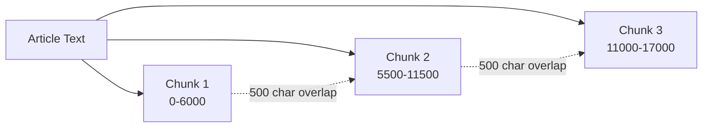

### Delivery

**Mode:** Diagram + verbal.

**Demo:** Do not demo chunking live.

**Say:** Chunking is a modeling choice. The current values are implemented defaults.

---

## Slide 6 - Extraction

### Slide Content

**Default graph extraction**

- GLiNER-BioMed detects entities.
- The entity threshold is 0.50.
- The entity types are Drug, Condition, Symptom, RiskFactor, and Biomarker.
- A small terminology file normalizes known names.
- MiniLM helps match similar names.
- The relationship scorer checks nearby entity pairs.
- The scorer uses meaning, word cues, distance, and entity confidence.
- The validator rejects invalid records.

### Slide Visual

Use this Mermaid diagram.

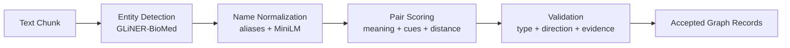

### Delivery

**Mode:** Diagram + verbal.

**Demo:** Do not run extraction live.

**Say:** The default graph extraction path is non-generative. Qwen is used later for answers.

---

## Slide 7 - Example Fact

### Slide Content

**Example transformation**

Source text:

`...optimal LDL-C reduction on statin monotherapy...`

Detected entities:

- `Statins` is a Drug.
- `LDL-C` is a Biomarker.

Normalized entity:

- `LDL-C` becomes `LDL cholesterol`.

Graph fact:

- `(Statins)-[:REDUCES]->(LDL cholesterol)`
- The edge keeps evidence and chunk ID.

### Slide Visual

Use this Mermaid diagram.

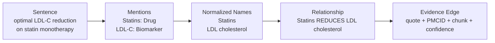

### Delivery

**Mode:** Diagram + verbal.

**Demo:** You can show a matching edge on the Graph page.

**Say:** This is a human-reviewed gold example. It shows the target structure.

---

## Slide 8 - Knowledge Graph

### Slide Content

**Graph model**

- Papers become Paper nodes.
- Biomedical concepts become entity nodes.
- `MENTIONS` edges link papers to entities.
- Biomedical relationships become typed edges.
- Entity IDs use type and normalized name.
- Edge IDs include endpoints, type, PMCID, chunk, and evidence.
- Neo4j loads records with `MERGE`.

**Why this helps**

- The graph supports direct relationship queries.
- Each edge keeps evidence.
- Each answer can show its source path.

### Slide Visual

Use this Mermaid diagram.

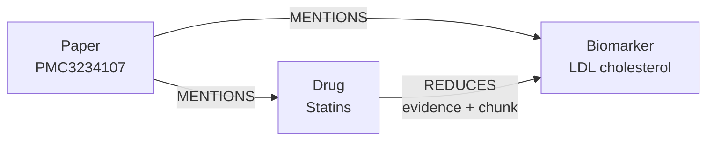

### Delivery

**Mode:** Demo + diagram.

**Demo:** Open Graph. Search `statins`. Select one relationship. Show the evidence fields.

**Say:** Neo4j stores the graph. The important object is the evidence-bearing relationship.

---

## Slide 9 - Graph Question Answering

### Slide Content

**Question answering**

- The retriever expands question terms.
- Neo4j finds matching graph nodes.
- Cypher retrieves direct edges.
- Cypher can retrieve two-hop paths.
- The retriever ranks evidence records.
- The answerer uses up to 12 evidence objects.
- Qwen 2.5 writes a JSON answer.
- The answerer abstains when evidence is not enough.

**Important limit**

- This is not vector chunk RAG.
- It retrieves graph paths and definitions.

### Slide Visual

Use this Mermaid diagram.

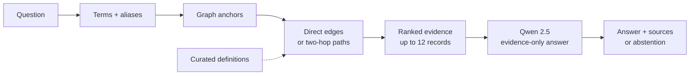

### Delivery

**Mode:** Demo + diagram.

**Demo:** Open Chat. Ask one prepared question.

Use one of these questions:

- `What does statin therapy reduce?`
- `How are triglycerides associated with cardiovascular risk?`
- `What evidence links LDL cholesterol and cardiovascular disease?`

**Say:** The model receives graph evidence. It does not receive full articles.

---

## Slide 10 - Evaluation

### Slide Content

**Graph construction evaluation**

- Gold set: 5 papers.
- Gold set: 43 chunks.
- Entity F1: **0.528**.
- Relationship F1: **0.086**.
- Earlier frontier reference entity F1: **0.655**.
- Earlier frontier reference relationship F1: **0.484**.

**Question answering evaluation**

- Question set: 6 development questions.
- Retrieval recall: **0.333**.
- Answer accuracy: **0.333**.
- Citation support: **0.667**.

### Slide Visual

Use this Mermaid diagram.

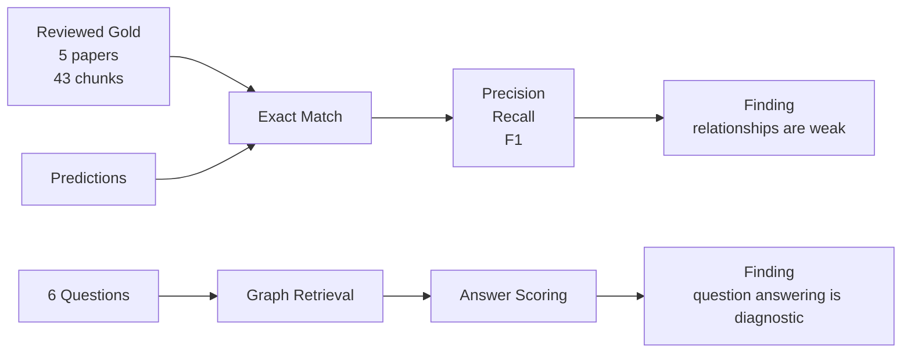

### Delivery

**Mode:** Diagram + verbal.

**Demo:** Do not run evaluation live.

**Say:** These results are development results. They do not prove general performance.

---

## Slide 11 - Trade-Offs

### Slide Content

**Design choices and costs**

- Chunk size controls context and ambiguity.
- A strict ontology supports validation.
- A strict ontology can omit useful facts.
- Local extraction improves control.
- Local extraction currently misses many relationships.
- Name normalization reduces duplicates.
- Small terminology can miss synonyms.
- Graph paths improve traceability.
- Missing graph facts still cause answer errors.

### Slide Visual

Use this Mermaid diagram.

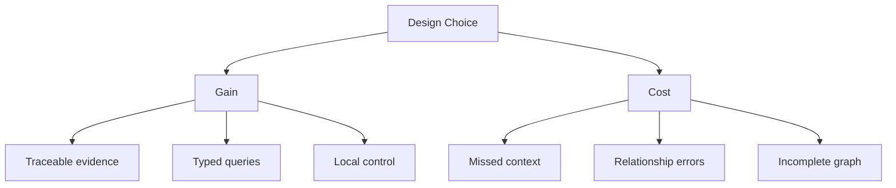

### Delivery

**Mode:** Diagram + verbal.

**Demo:** Do not demo this slide.

**Say:** The graph does not make all answers correct. It makes the evidence easier to inspect.

---

## Slide 12 - Conclusion

### Slide Content

**What the project achieved**

- It built an end-to-end graph retrieval and answer system.
- It converts PMC text into graph evidence.
- It answers questions with sources.
- It can abstain when evidence is weak.
- It tracks experiments with DVC and MLflow.

**Main result**

- Entity extraction performs better than relationship extraction.
- Relationship extraction limits the current system.

**Next work**

- Audit schema and gold labels.
- Build a larger PMCID holdout set.
- Improve relationship extraction.
- Add chunk-vector RAG.
- Compare graph, vector, and hybrid retrieval.
- Measure latency and cost.

### Slide Visual

Use this Mermaid diagram.

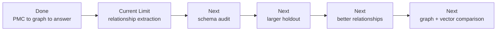

### Delivery

**Mode:** Diagram + verbal.

**Demo:** End on the slide. Do not switch back to the app unless asked.

**Say:** The strongest claim is about traceability. The project shows where the pipeline works and where it fails.
