# Local Non-Instruct Application Ingestion Flow

This is the function path used when a document is ingested through the application with the app profile set to `local-non-instruct`.

```mermaid
flowchart TD
    UI["IngestionPage.vue\nsubmit ingestion form"] --> Client["apiClient.createIngestionJob()\nPOST /ingestion/jobs"]
    Client --> Route["apps/api/app/routes/ingestion.py\ncreate_ingestion_job()"]
    Route --> ServiceCreate["IngestionQueueService.create_job()"]
    ServiceCreate --> ResolveProfile["IngestionQueueService._active_ingestion_profile()\nget_app_model_profile()"]
    ResolveProfile --> Profile["packages/llm/profiles.py\nresolve_model_profile('local-non-instruct')\nextractor_provider = non_instruct\nentity_model = Ihor/gliner-biomed-small-v1.0"]
    ServiceCreate --> Store["IngestionJobStore.create_job()\ninsert queued job + document rows"]

    Store --> Worker["IngestionQueueService._worker_loop()"]
    Worker --> Claim["IngestionQueueService.run_next_job_once()\nIngestionJobStore.claim_next_job()"]
    Claim --> RunJob["IngestionQueueService._run_job()"]
    RunJob --> RuntimeProfile["get_app_model_profile()\nbuild PipelineConfig"]

    RuntimeProfile --> SourceBranch{"job sourceType"}
    SourceBranch -->|pmc| PMC["pipelines/ingestion/pipeline.py\nprocess_pmc_articles()"]
    SourceBranch -->|text| Text["pipelines/ingestion/text_pipeline.py\nprocess_text_documents()"]

    PMC --> Fetch["fetch_pmc_bioc()\nparse_bioc_payload()"]
    Text --> TextArticle["_article_from_text()"]
    Fetch --> Chunk["chunk_article()"]
    TextArticle --> Chunk

    Chunk --> BuildConfig["NonInstructPipelineConfig(...)\nentity_threshold = 0.5 by default"]
    BuildConfig --> Factory["get_extractor(provider='non_instruct', ...)\nreturn NonInstructExtractor"]

    Factory --> Loop["for each chunk"]
    Loop --> Extract["NonInstructExtractor.extract(document, chunk)"]

    Extract --> Gliner["GLiNERExtractor._extract_entities()\nGLiNER.predict_entities(text,\n  labels = Drug, Condition, Symptom,\n  RiskFactor, Biomarker,\n  threshold = entity_threshold)"]
    Gliner --> Canonical["_canonical_label()\nkeep only supported biomedical labels"]
    Canonical --> Mentions["NonInstructExtractor._normalized_mentions()\nTerminologyNormalizer.normalize()"]
    Mentions --> Score["RelationCandidateScorer.score()"]
    Score --> Accept["accepted_relationships()"]
    Accept --> RawOutput["raw output:\nentities + relationships + rejected_candidates"]

    RawOutput --> Validate["validate_extraction_output()\ncanonicalize types, ids, endpoints,\nrelationship directions, confidence"]
    Validate --> Record["build_processed_record()\nwrite processed JSON + manifest"]
    Record --> LoadBranch{"skipLoad?"}
    LoadBranch -->|false| Neo4j["load_processed_record()\nmerge entities/relationships into Neo4j"]
    LoadBranch -->|true| Skip["mark load_status = skipped"]
    Neo4j --> Finish["IngestionJobStore.record_document_result()\nIngestionJobStore.finish_job()"]
    Skip --> Finish
```

## Key Detection Point

Entity type detection itself happens inside:

- `pipelines/ingestion/extractors.py`: `BIOMEDICAL_LABELS`
- `pipelines/ingestion/extractors.py`: `GLiNERExtractor._extract_entities()`
- `pipelines/ingestion/extractors.py`: `NonInstructExtractor.extract()`

For `local-non-instruct`, relationships are not generated by Qwen. They are produced by the non-instruct semantic path: normalized GLiNER mentions are paired and scored by `RelationCandidateScorer`, then filtered by `accepted_relationships()`.
