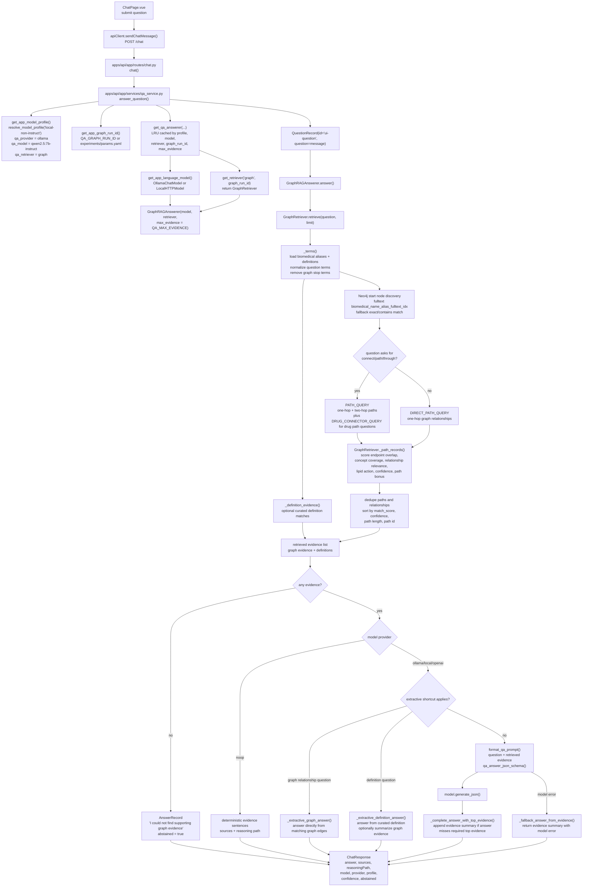
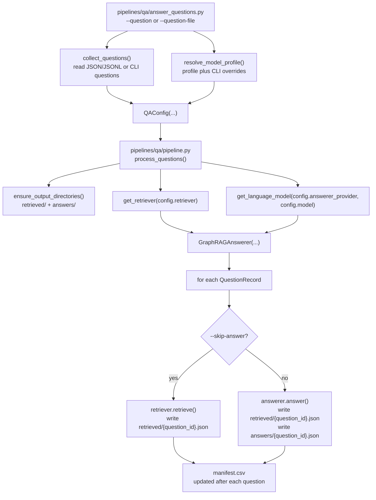

# Local Non-Instruct Question Answering Flow

This is the function path used when a biomedical question is answered through the
application with the app profile set to `local-non-instruct`. The same core QA
components are also used by the batch CLI.

## Batch CLI Path

The batch runner uses the same retriever and answerer, but writes artifacts for
inspection.

## Key Retrieval And Answer Points

- Query entrypoint: `apps/api/app/routes/chat.py`: `chat()`
- App runtime resolution: `apps/api/app/services/qa_service.py`: `get_app_model_profile()`, `get_app_graph_run_id()`, `get_qa_answerer()`
- Batch entrypoint: `pipelines/qa/answer_questions.py`: `main()`
- Shared batch core: `pipelines/qa/pipeline.py`: `process_questions()`
- Graph retrieval: `packages/qa/retrievers.py`: `GraphRetriever.retrieve()`
- Evidence scoring: `packages/qa/retrievers.py`: `GraphRetriever._path_records()`
- Answer generation and fallbacks: `packages/qa/answerers.py`: `GraphRAGAnswerer.answer()`

For `local-non-instruct`, question answering still uses an instruct-capable local
QA model by default (`qwen2.5:7b-instruct` through Ollama). The
`local-non-instruct` part refers to the ingestion/extraction side of the profile;
QA retrieves from the graph produced by that pipeline and then answers from the
retrieved evidence.
